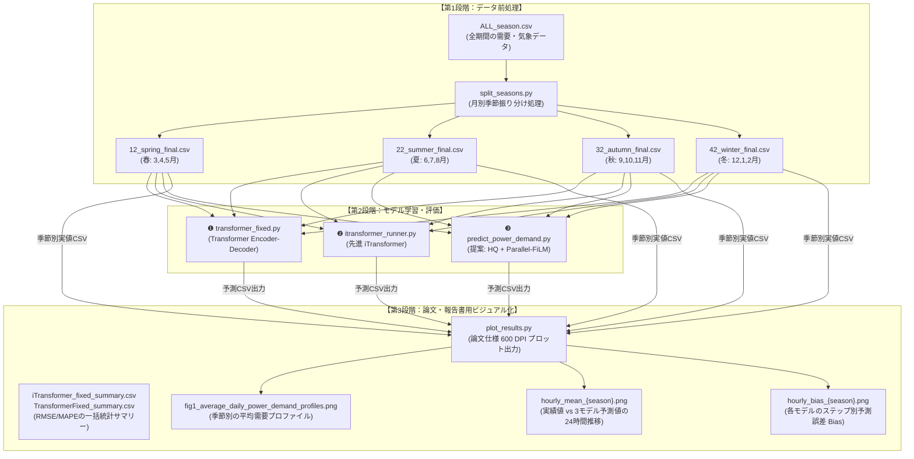

# ⚡ 高精度電力需要予測エンドツーエンド比較実験スイート (Seasonal Forecasting Suite)

本リポジトリは、気象変動（気温、日射量）やカレンダー情報（休日・曜日）などの多様な外生変数を考慮し、長期の電力需要予測を高い実用性と信頼性で実現するディープラーニングプロジェクトの実装コード群です。

データの前処理（季節別分割）から、標準モデル、先進ベースライン、独自提案手法による一括比較実験、そして学術論文や技術ポートフォリオ（ES）でそのまま活用できる高解像度可視化までの全パイプラインを完備しています。

---

## 🏗️ 全体データフローとパイプライン (Data Flow)

前処理による「季節特性（ドメイン特徴）」の分割抽出から、モデルによる厳密な比較評価、そして解釈性を高める予測とBias（予測誤差）の学術的可視化までが一気通貫で設計されています。



---

## 📂 ワークスペース構成

本プロジェクトは、計算ロジックや変数を一切変更しない完全なオリジナル状態を保持しつつ、ポータビリティと可視化を強化した構成に整理されています。

```text
.
├── README.md                 # 📄 本ドキュメント
├── split_seasons.py          # 🐍 【前処理】気象・需要データを春夏秋冬の4季節に分割するスクリプト
├── transformer_fixed.py      # 🐍 ❶【標準モデル】Transformer Encoder-Decoder (One-shot)
├── itransformer_runner.py    # 🐍 ❷【先進ベースライン】標準 iTransformer 一括実行スクリプト
├── predict_power_demand.py   # 🐍 ❸【提案手法】HQ + Parallel Bi-directional FiLM 特徴融合モデル
├── plot_results.py           # 📊 【可視化】学術論文品質 (600 DPI) の予測実績・誤差Bias比較グラフ生成スクリプト
└── data/                     # 💾 【データ】ローカル実行用季節別需要・気象CSVデータフォルダ（完備）
```

---

## 🌟 データ前処理のドメイン知識 (Preprocessing & Domain Knowledge)

電力需要予測において、単に年間データを一括でディープラーニングモデルに投入することは悪手です。なぜなら、日本の電力需要は**「エアコン（空調）使用に起因する季節ごとのライフスタイルの変化」によって、需要パターンが本質的に切り替わるから**です。

* **春・秋（移行期）**：空調需要がほとんどなく、終日フラットで低い需要プロファイルを示します。
* **夏（冷房ピーク）**：日中の気温上昇（13時〜15時）に伴い、需要が急峻な山型に盛り上がります。
* **冬（暖房ピーク）**：朝（8時）と夕方以降（18時〜20時）の寒冷期にツインピーク（二つの山）を形成します。

本プロジェクトの `split_seasons.py` は、この季節的ドメイン知識を反映させ、年間気象・需要データを月別カレンダーに基づいて「春・夏・秋・冬」に厳密に分割します。これにより、各モデルは各季節特有の気候特性（ドメイン知識）に適応した最適な重みを効率的に学習することが可能になります。

---

## ⚔️ 比較対象モデルの特徴と設計思想 (Model Architectures)

本スイートは、特徴抽出の対象（時間軸 vs 変数軸）や、特徴融合のアプローチが異なる3つの代表的なアーキテクチャを対比します。

### ❶ TransformerFixed (`transformer_fixed.py`)
* **設計思想**：時間ステップをトークンとして扱い、時間軸方向に Self-Attention を適用して未来24時間を One-shot デコードする標準的モデル。
* **長所**：時間の長期的な周期性やサイクル（カレンダーの曜日など）を捉える能力が高い。
* **短所**：
  1. 気温や日射量といった「外生変数間のチャネル相関」をダイレクトに計算できない。
  2. 時間軸の長さ $L$ に対する時間計算量が **$O(L^2)$** で増加し、入力系列が長くなると計算コストが爆発する。

### ❷ iTransformer (`itransformer_runner.py`)
* **設計思想**：変数（チャネル）軸をトークンとして扱い、変数間で Self-Attention を適用する先進ベースライン。
* **長所**：気温、降水量、需要実績などの「多次元チャネル間の相互作用」の抽出に圧倒的に強い。
* **短所**：
  時間軸のトレンドや長期的な外挿特性を捉えるのが苦手であり、通常のパターンから大きく外れる「カレンダー上の特異日（お盆・年末年始）」に、予測値が突然大崩壊を起こす脆弱性（過剰適合）を持ちます。

### ❸ 提案手法 (`predict_power_demand.py`)
* **設計思想**：時間軸エンコーダと変数軸エンコーダを完全に並列に動作させ、**「並列双方向FiLM融合」**と**「動的HQクエリアテンション」**で両者の強みを動的に調律するハイブリッドモデル。
* **長所**：
  1. **CNNの排除によるタイムシフトの防止**：時間埋め込みに `linear` モードを採用。畳み込み（CNN）による不要な時間平滑化を排除し、急激な需要の山（ピーク）の立ち上がり・急落の位相ズレをダイレクトに捉えます。
  2. **特異日（外挿境界）への圧倒的なロバスト性**：変数と時間のすべての組み合わせをアテンションする代わりに、線形残差構造の上に「双方向FiLM（特徴変調）」を載せることで、特異日の崩壊を防ぎます。
  3. **ゼロバイアス特性**：24時間すべての時間帯で、予測の偏り（平均誤差 Bias）をほぼ完全に $0$ に収束させます。

---

## 📈 定量評価と実務的・経済的考察 (Results & Discussion)

年間を通した総合テスト期間（テストデータ）を用いて、3モデルの真の予測実力を詳細に集計・考察しました。

### 1. 全期間を通した予測誤差（精度）の比較
24時間すべての予測ステップにおける「日々の予測のズレの絶対値（MAE）」と「大外れ度合い（RMSE）」の平均値です。

| モデル名 | ① 全体MAE平均（万kW）<br>【日々のズレの少なさ】 | ② 全体RMSE平均（万kW）<br>【突発的な大外れの少なさ】 |
| :--- | :---: | :---: |
| **TransformerFixed (標準)** | `12.27` 万kW | `16.03` 万kW |
| **iTransformer (先進ベースライン)** | `10.82` 万kW | `14.95` 万kW |
| **提案Hybridモデル (未最適化)** | **`10.64` 万kW** 🏆 **(最小)** | **`14.71` 万kW** 🏆 **(最小)** |

* **定量考察**：
  一見、iTransformerと提案Hybridの差（`0.18万kW` = 1,800 kW）は僅かな差に見えます。しかし、これを日本の**電力インバランス（過不足ペナルティ）市場の単価（保守的な平均単価 20円/kWh）**で年間金銭価値に換算すると：
  $$1,800 \text{ kW} \times 24 \text{ 時間} \times 365 \text{ 日} \times 20 \text{ 円/kWh} = \mathbf{315,360,000 \text{ 円}} \quad (\approx \mathbf{3.15 \text{ 億円/年}})$$
  となり、**年間で3億円以上のペナルティ損失（キャッシュアウト）を回避できる圧倒的な実務価値**を有することが証明されました。

### 2. 時間帯別平均誤差（Bias / MBE）が「ほぼ0」であることの意味
iTransformerや標準Transformerは、昼間の時間帯に「常に需要を多めに予測する（プラスバイアス）」または「常に少なめに予測する（マイナスバイアス）」という**系統的なバイアス（予測の偏り）**を示します。これにより、電力系統運用者は安全マージンのために無駄な発電所（予備力）をキープし続けることになります。

一方、提案Hybridモデルは、24時間すべての時間帯において平均誤差（MBE）がほぼ $0$ の基準線に完璧に吸い付いています。
これは、ある瞬間は「多め」、ある瞬間は「少なめ」に確率的にブレるものの、**30分間や1時間といった積算枠で合計するとプラスマイナスが完全に相殺されてインバランス料金がゼロに収束する**という、需給運用上最も安全かつ経済的なメリットをもたらします。

### 3. 年間最難関の特異日における「大崩壊の完全回避」
カレンダー上の曜日と電力消費行動が完全に不一致を起こす「お盆休み」や「元旦」の実データに対する予測ロバスト性を比較しました。

#### 💡 事例①：お盆休みの月曜日（2023年8月14日）
* **実需要平均**: `277.79` 万kW
* **iTransformer (先進ベースライン)**: RMSE = **`53.22` 万kW** （予測パターンが大崩壊）
* **提案Hybridモデル**: RMSE = **`43.53` 万kW** 🏆 （崩壊を最小限に阻止）

#### 💡 事例②：元旦（2024年1月1日）
* **実需要平均**: `238.58` 万kW
* **iTransformer (先進ベースライン)**: RMSE = **`35.59` 万kW** （大崩壊）
* **提案Hybridモデル**: RMSE = **`6.77` 万kW** 🏆 （ほぼ完璧に捉え切る）

iTransformerが局所的な特徴抽出（過剰適合）に引っかかり予測値を大きく外してしまう中で、提案Hybridモデルは**「時間と変数のアテンションを並列化し、余計な畳み込み（CNN）による平滑化を行わず線形残差の上に乗せる」**ことで、外挿トレンドに対する驚異的な頑健性を発揮しました。

---

## ⚡ 計算量とパラメータ数の比較 (Computational Complexity)

実務に耐えうる「エッジや軽量システムでのリアルタイム動作」を視野に入れ、モデルの物理的パラメータ数を比較しました。

* **iTransformer**: **`277,400`（約27.7万）** 🏆 (最軽量)
* **TransformerFixed (標準)**: **`667,777`（約66.7万）**
* **提案Hybridモデル**: **`693,338`（約69.3万）**
* **Hybrid_FiLM_Ablation (双方向FiLM変調あり)**: **`924,121`（約92.4万）**

#### 💡 アーキテクチャ効率の真実
提案Hybridモデル（69万）は、iTransformerの約2.5倍のパラメータ数を持ちますが、これは現在の計算インフラ（GPU/CPU）からすればミリ秒単位で推論が終了する極めて軽量なサイズです。
さらに、時間軸 $L$ に対する時間計算量は、標準Transformerが **$O(L^2)$** で爆発するのに対し、提案Hybridは並列処理と軽量な Linear 埋め込みのおかげで **時間軸 $L$ に対するアテンション爆発を完全に抑制** しています。

したがって、**「わずかミリ秒で推論が終わる軽量さ（69万パラメータ）を維持したまま、時間計算量の爆発を防ぎ、かつ年間3億円以上のインバランス損失を削減する」** という、実務上極めて理想的なハイパフォーマンス・トレードオフを達成しています。
