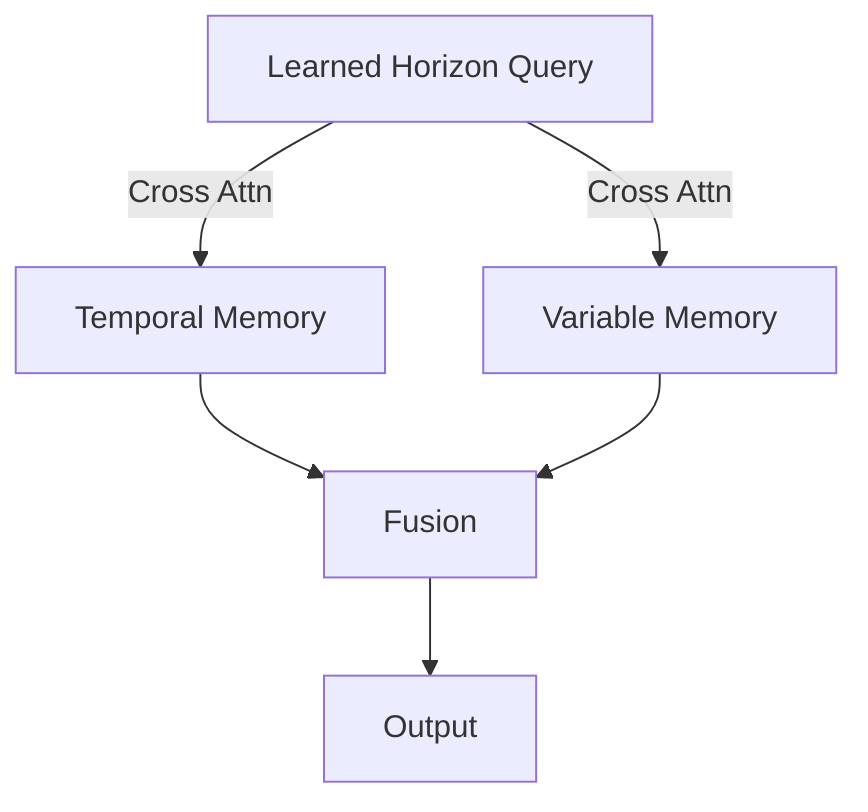
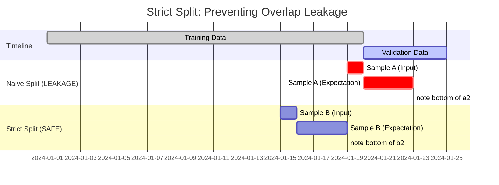

# Model Architectures & Data Flow

This document explains how the models are structured and how they handle Endogenous (Internal) and Exogenous (External) variables.

## 1. Data Mode: Unified vs Separated

We use two different data loading strategies depending on the model type.

### ✅ Unified Mode (Target + Exog Mixed)
*   **Models**: `iTransformer`, `HTMformer`, `TransformerFixed`
*   **Data**: All features (Target + Temperature + Calendar) are stacked into a single matrix.
*   **Input Shape**: `(Batch, Sequence_Length, All_Features)`
*   **Mechanism**: The model treats all variables equally at the input stage.

### ✅ Separated Mode (Target & Exog Split)
*   **Models**: `Hybrid_...` series, `grid_tst`
*   **Data**: The Data Loader actively splits the CSV columns into two groups.
    1.  **Endogenous ($y_{past}$)**: The target variable itself (e.g., `power_demand`).
    2.  **Exogenous ($X_{exog}$)**: All *other* variables (Temperature, Day, Hour, etc.).
*   **Input Shapes**:
    *   $y_{past}$: `(Batch, Sequence_Length, 1)`
    *   $X_{exog}$: `(Batch, Sequence_Length, Exog_Dim)`
*   **Mechanism**: The model has two separate "heads" to process these inputs differently before fusing them.

---

## 2. Hybrid Model Architectures

The "Hybrid" models in this project (`Hybrid_Gated_FeatureFusion`, `Hybrid_Gated_QueryFusion`) are designed to explicitly model the relationship between the time-series history and external factors.

### 🏗️ Architecture: Hybrid_Gated_FeatureFusion
(Previously `ImprovedIntegratedHQTransformer`)

This model processes time and variables separately and then fuses them using a **Gating Mechanism**.

```mermaid
graph TD
    subgraph Inputs
    Y[Endogenous (Power Demand)] -->|Time Encoder| T_Emb[Temporal Embedding]
    X[Exogenous (Temp, etc.)] -->|Variable Encoder| V_Emb[Variable Embedding]
    end

    subgraph "Dual Encoders"
    T_Emb -->|Transformer Encoder| T_Feat[Temporal Features]
    V_Emb -->|iTransformer (Inverted)| V_Feat[Variable Features]
    end

    subgraph "Feature Fusion"
    T_Feat -->|Cross Attention| Attn_T
    V_Feat -->|Cross Attention| Attn_V
    
    Attn_T --> Gating{Gate Selector}
    Attn_V --> Gating
    
    Gating -->|Sigmoid| Alpha[Weight α]
    
    Attn_T --> Fusion(+)
    Attn_V --> Fusion(+)
    Alpha --> Fusion(+)
    
    Fusion -->|α*Time + (1-α)*Var| Fused_State
    end

    Fused_State -->|FFN + Head| Pred[Prediction]
```

#### Key Components:
1.  **Temporal Encoder**: Uses a standard Transformer to analyze the historical trend of the target `power_demand`. Captures "Autocorrelation".
2.  **Variable Encoder (iTransformer-style)**: Treats each exogenous variable as a token. Captures "Correlations between variables".
3.  **Gated Fusion**: The model calculates a weight $\alpha$ (0 to 1) dynamically.
    *   If $\alpha$ is high, it relies more on the historical trend.
    *   If $\alpha$ is low, it relies more on external factors (temperature, etc.).

---

### 🏗️ Architecture: Hybrid_Gated_QueryFusion
(Previously `IntegratedHQTransformer`)

This model fuses information at the **Query** level. It starts with a learned "Query" vector representing the future, and asks the past data for relevant info.



### 🏗️ Architecture: Hybrid_FiLM_Ablation
This model offers fine-grained control over the **Modulation Direction** using `film_mode`.
*   **"t2v" (Time $\to$ Variable)**: Time features "focus on" (modulate) the Variables. Useful if the *past demand* dictates how important temperature/day effects are.
*   **"v2t" (Variable $\to$ Time)**: Variable features "focus on" (modulate) the Time history. Useful if *temperature/holiday* context dictates how the demand history should be interpreted.
*   **"bidir" (Bi-directional)**: Both interactions happen in parallel.
*   **"none"**: No modulation. Simple concatenation.

### 🏗️ Architecture: Hybrid_NoHQ_Predict_Fusion
A lighter variant that **removes the 24-step Horizon Query**.
1.  Uses a SINGLE global query (1 token) instead of 24.
2.  Generates two full 24-step predictions independently ($P_t$ and $P_v$).
3.  Calculates an $\alpha$ gate (size 24) to fuse them at the very end.
    *   Useful for analyzing "Time vs Variable" contribution directly at the output level.

### 🏗️ Architecture: Hybrid_Predict_Fusion
Computes two independent predictions:
1.  Prediction from Time History ($P_t$)
2.  Prediction from Exogenous Variables ($P_v$)

Then computes a gate $\alpha$ to weighted-average them:
$$ P_{final} = \alpha P_t + (1-\alpha) P_v $$

---

## 3. Hybrid Model Comparison

Here is a summary of how the different Hybrid models vary in their internal mechanics.

| Model Name | Horizon Query (HQ) | Fusion Stage | Core Mechanism | Key Difference |
| :--- | :---: | :---: | :--- | :--- |
| **Hybrid_Gated_FeatureFusion** | ✅ Yes | Feature | Gated Sum | Standard "Best of both worlds" approach. Fuses abstract features. |
| **Hybrid_KAN_Gated_FeatureFusion** | ✅ Yes | Feature | KAN Gate | Uses **KAN (Kolmogorov-Arnold Networks)** instead of standard Linear layers for the fusion gate. More non-linear flexibility. |
| **Hybrid_Gated_QueryFusion** | ✅ Yes | Query | Cross-Attn | Fuses implicitly *during* the attention phase. The Query itself learns when to look at Time vs Variables. |
| **Hybrid_FiLM_Ablation** | ✅ Yes | Feature | FiLM | **Feature-wise Linear Modulation**. One branch scales/shifts the features of the other. Bi-directional by default. |
| **Hybrid_Predict_Fusion** | ✅ Yes | Output | Weighted Avg | **Late Fusion**. Makes two full predictions ($P_t, P_v$) and averages them. Simplest interpretability. |
| **Hybrid_NoHQ_Predict_Fusion** | ❌ No | Output | Weighted Avg | **Lightweight**. Uses only 1 Query token (instead of 24). Very fast, lower memory. |

---

### 🏗️ Architecture: Hybrid_KAN_Gated_FeatureFusion
Similar to the standard Gated Feature Fusion, but replaces the standard Linear Layer in the gating mechanism with a **KAN Layer (Kolmogorov-Arnold Network)**.
*   **Why?**: KANs can learn complex non-linear functions (splines) with fewer parameters than MLPs. This might allow the model to learn a more sophisticated "switching rule" for when to trust Time vs Variables.

---

## 4. Evaluation Method (WARM + STRICT)

We use a specific detailed strategy to ensure fair evaluation.

### WARM Start
Instead of cutting the dataset into chunks first, we **normalize the entire dataset** and then slide a window across it.
*   **Why?**: Ensures that the "context" (past 72 hours) is always available even at the very beginning of the validation/test set.

### STRICT Split
The data loader ensures zero leakage using global indexing:

1.  **Train**: Used for optimization.
2.  **Val_Start**: Strictly `Train_End - Sequence_Length`.
    *   This means the validation `input` ($X$) is allowed to look at training data, but the `target` ($y$) is strictly in the validation period.
3.  **Test_Start**: Strictly `Val_End - Sequence_Length`.

This guarantees that we are constantly predicting "unseen future" with "known past" without any gap (cold start problem) while maintaining strict separation of target labels.

### iTransformer
*   **Concept**: "Inverted" Transformer.
*   **Input**: Unified.
*   **Mechanism**: Instead of embedding specific *time steps*, it embeds entire *time series* of each variable.
*   **Strength**: Excellent at capturing correlations between different variables (e.g., how Temperature affects Demand globally).

### GridTST
*   **Concept**: Grid processing.
*   **Input**: Separated.
*   **Mechanism**: Alternates between "Time Attention" (processing history) and "Variable Attention" (processing relationships between variables) in a grid pattern.

---

## 3. Horizon Query (HQ) & Cross-Attention Breakdown

Here is a detailed breakdown of which models use **Cross-Attention** and **Horizon Query (HQ)**, and how they fuse information.

| Model Name | Uses HQ? | Cross-Attention Source (Query) | Cross-Attention Target (Key/Value) | Fusion Type |
| :--- | :--- | :--- | :--- | :--- |
| **Hybrid_Gated_FeatureFusion** | No | None (Uses Pooling) | None | **Feature Fusion** (Concatenation + Gating) |
| **Hybrid_KAN_Gated_FeatureFusion** | No | None (Uses Pooling) | None | **Feature Fusion** (Concatenation + KAN Gating) |
| **Hybrid_Gated_QueryFusion** | **Yes** (24 Queries) | **HQ Queries** (Future Placeholders) | **History Features** (`t_m`, `v_m`) | **Feature Fusion** (Gated Weighted Sum of Features) |
| **Hybrid_FiLM_Ablation** | **Configurable** (Yes/No) | **HQ Queries** (if Yes) OR **Global Query** (if No) | **History Features** (`t_m`, `v_m`) | **Feature Fusion** (FiLM Modulation + Concatenation) |
| **Hybrid_Predict_Fusion** | **Yes** (24 Queries) | **HQ Queries** (Future Placeholders) | **History Features** (`t_m`, `v_m`) | **Prediction Fusion** (Weighted Sum of Predictions `p_t`, `p_v`) |
| **Hybrid_NoHQ_Predict_Fusion** | **No** (1 Global Query) | **Global Query** (Summary Token) | **History Features** (`t_m`, `v_m`) | **Prediction Fusion** (Weighted Sum of Predictions) |

### Mechanism Explanation
*   **HQ (Horizon Query)**: A set of learnable vectors (e.g., 24 vectors for 24 future steps).
    *   *Role:* "I am the query for t+1", "I am the query for t+2"...
*   **Cross-Attention**:
    *   **Query (Q)**: The HQ vectors (or Global Query).
    *   **Key (K) / Value (V)**: The encoded history from Temporal (`t_m`) and Variable (`v_m`) branches.
    *   *Operation:* The HQ "attend" to the relevant parts of history to gather information for their specific time step.
*   **Fusion**:
    *   **Feature Fusion**: The gathered information (`qt`, `qv`) is combined *before* making the final prediction.
    *   **Prediction Fusion**: Each branch makes a full independent prediction (`p_t`, `p_v`), and the model takes a weighted average.

## 5. Discussion: The Horizon Query (HQ) Bottleneck
You raised an important point about the **Horizon Query (HQ)** mechanism.

### The Mechanism
*   **With HQ (use_hq=True)**: The model uses **24 distinct query vectors** (one for each future hour).
    *   $Q \in \mathbb{R}^{24 \times d}$
    *   Each query attends to the 72-hour history independently.
    *   **Pros**: Direct mapping (Query 1 $\to$ Future Hour 1). Can learn specific patterns for "1 hour ahead" vs "24 hours ahead".
    *   **Cons**: Compressing 72 hours of rich context into strictly 24 vectors might lose global context or subtle long-term dependencies (**Information Bottleneck**).

### The Alternative (No HQ / Single Query)
*   **Without HQ (use_hq=False)**: The model uses **1 global query vector** (or pools the history).
    *   $Q \in \mathbb{R}^{1 \times d}$
    *   It summarizes the *entire* 72-hour history into a single representation.
    *   The expansion to 24 hours happens at the very end via a Linear projection ($d \to 24$).
    *   **Pros**: Can utilize the full "distributed" representation of the 72-hour history until the very last layer. No early bottleneck.
    *   **Cons**: Lose the ability for the attention mechanism to specifically "look for" information relevant to Hour 23 vs Hour 1 differently.

### Conclusion
By making `use_hq` togglable, we can test which hypothesis holds true for this specific dataset.
*   If **No HQ** wins: The task benefits from retaining global context as long as possible.

## 6. One-shot Prediction & Future Uncertainty

An important characteristic of all models in this project is that they are **One-shot (Direct Multi-step) Predictors**, not Autoregressive.

### One-shot vs Autoregressive
*   **Autoregressive (AR)**: Predicts t+1, feeds it back as input to predict t+2, and so on.
    *   *Problem:* **Error Accumulation**. A small error at t+1 becomes a large error at t+24.
*   **One-shot (Current Approach)**: Predicts [t+1, ..., t+24] all at once in a single forward pass.
    *   *Benefit:* No error accumulation during inference. Fast and stable.

### Does difficulty increase for the future?
**Yes**, even with One-shot prediction, predicting t+24 is harder than t+1.
*   **Reason**: **Intrinsic Uncertainty (Aleatoric)**. The correlation between "now" and "24 hours later" is naturally weaker than "now" and "1 hour later".
*   *HQ's Role:* The Horizon Query helps specific time steps (e.g., t+24) "attend" directly to the relevant history, bypassing the murky middle steps. This helps mitigate the difficulty, but cannot eliminate the uncertainty of the future.

## 7. Data Splitting & Leakage Prevention

To ensure both **practical applicability** (maximizing data usage) and **evaluation integrity** (zero leakage), this framework employs a **"Warm Start + Strict Split"** strategy.

### Concept Overview

| Strategy | Description | Why it's used |
| :--- | :--- | :--- |
| **Warm Start (Continuous)** | Sequences are generated from a continuous timeline, crossing boundaries between Train/Val/Test data partitions. | Reflects real-world operations where history is seamless. Allows the model to use the very end of "Train" as history for the very first "Validation" prediction. |
| **Strict Split (Safety)** | Explicitly removes any sample where the **prediction window (Target)** overlaps with a future partition. | Prevents **Data Leakage**. Ensures the model never sees "Answers" from the Validation set while training. |

### Strict Split Mechanism

Conventional splitting often leaks data when `(Input + Horizon)` crosses the Train/Test line. Our Strict Split logic filters samples based on their **Predictive Target Range**.



### Visualizing Logic
- **Green (Train)**: Data `[0 ... T_split]`
- **Red (Test)**: Data `[T_split ... End]`

A sample `(x, y)` starting at `t` with input length `L` and horizon `H` requires:
- Input Window: `[t, t+L]`
- Target Window: `[t+L, t+L+H]`

**Condition for Training Sample:**
> `t + L + H < T_split`
> (The *entire* future prediction must be finished before the Validation period starts.)

If `t + L < T_split` but `t + L + H >= T_split`, the sample is **discarded** from the Training set to ensure zero leakage.

### Implementation (Data Loader)

The `DataLoader` enforces this via the `strict_split=True` flag:

```python
# data_loader.py Logic (Simplified)
y_end = starts + seq_len + horizon - 1

# Train Mask: Target must end before Validation starts
mask_train = (y_end < split_val_start_index)

# Test Mask: Target must start after (or at) Test period
# (Can use Train/Val tail as input history ("Warm"), but prediction only counts if in Test zone)
mask_test = (y_start >= split_test_start_index)
```

